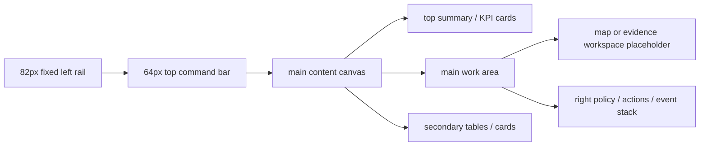

# FMG Embodied Intelligence Web System

Source evidence: `mp1joq1r-image.png`, `mp1kjp4r-image2.png`, `mp1kkaeu-image3.png`, `mp1kkjdk-image4.png`, `mp1kv65q-image5.png`, `mp1kv663-image6.png` at 1672 x 941.

## 1. Domain Archetype

Industrial embodied-intelligence operations console. The system is not a marketing product surface: it is a high-density B2B control UI for operators reviewing robot missions, spatial route safety, anomaly evidence, emergency intervention, and skill readiness.

Dominant page structure:



## 2. Layout System

- Canvas baseline: 1672 x 941 desktop screenshot; implementation is responsive but desktop proportions take priority.
- Left rail: 82px wide, full height, white surface, 1px right border, icon cells 50px, active cell 52 x 52 with 9px radius.
- Top bar: 64px high, white surface, bottom border. Page title starts at x=100, filters and status cluster align right.
- Content inset: 14-18px top, 16-20px sides, 12-16px grid gaps.
- Primary card radius: 10-12px. Small rows/chips: 5-8px. Avoid large SaaS radii.
- Main page grids:
  - Mission orchestration: main column `1fr`, right column about 470px.
  - Spatial intelligence: left layer panel 180px, central map `1fr`, right policy panel 300-318px.
  - Detail pages: evidence/workspace `1fr`, right action stack 260-318px.
  - Registry: taxonomy panel 360px, detail body `1fr`, right evidence/standards stack 510px.
- Tables use fixed layout, 28-38px rows, 9-11px cell text, 1px dividers, no zebra striping.

## 3. Color System

Use the existing `brand-spec.md` tokens as the source of truth.

```css
:root {
  --bg:      oklch(98.3% 0.003 286.4);
  --surface: oklch(100.0% 0.000 89.9);
  --fg:      oklch(28.1% 0.002 286.3);
  --muted:   oklch(47.6% 0.001 17.2);
  --border:  oklch(92.6% 0.005 286.3);
  --accent:  oklch(69.1% 0.177 134.2);
  --danger:  oklch(55.8% 0.193 25.6);
  --warning: oklch(80.3% 0.110 58.2);
  --info:    oklch(51.3% 0.185 259.0);
}
```

Usage rules:

- FMG green is the only brand accent: active nav, approved/ready/verified states, primary CTA.
- Red means high priority, blocked route, emergency stop, offline, missing context.
- Orange means pending review, verification needed, collision risk, limited readiness.
- Blue means in progress, selected step, executing, map route, and information.
- Neutral grey means simulator-only, maintenance, inactive, or unavailable. Do not introduce purple or additional category colors.

## 4. Typography System

- Font stack: Apple system UI for text, JetBrains/IBM/ui-monospace for numerics and IDs.
- Page title: 19-22px, 650 weight, -0.01em tracking.
- Card title: 12-14px, 650-700 weight.
- Table/list row text: 9-11px, line height 1.25-1.35.
- Metadata labels: 8.5-10px, muted, positive tracking only when uppercase.
- KPI values: 18-22px, 650-700 weight, tabular numerics.
- Buttons: 10.5-12px, 600 weight, 34-42px height depending on context.

## 5. Effects And Layering

- Surfaces rely on borders and subtle container shadow only: no decorative glow.
- Shadow token: `0 10px 28px oklch(28.1% 0.002 286.3 / 0.065)`.
- Map placeholder uses pale terrain texture, dashed route overlays, soft labels, and a bottom legend.
- Floating cards on maps may have 90-96% white alpha and the same 1px border.
- Emergency controls may use stronger fills, but only where the screenshot shows safety-critical affordance.

## 6. Component System

- `AppShell`: left rail + top bar + scrollable content.
- `MetricCard`: icon bubble, label, value, sublabel, optional status color.
- `InfoCard`: dense white card with title row, action link, compact body.
- `StatusChip`: 18-24px high, tiny radius, semantic soft background.
- `DataTable`: fixed layout, compact rows, tiny text, no zebra.
- `ChecklistStep`: numbered circle, title, status chip, optional connector.
- `MapPlaceholder`: terrain background, route lines, zones, labels, legend, zoom controls.
- `EvidenceTile`: cropped mock asset, tiny metadata, status label.
- `RightStack`: vertical policy/action/event cards with 10-12px gaps.

## 7. Page Tree

```mermaid
flowchart TD
  O["AI Operations Command Center"] --> O1["Operations KPI Row"]
  O --> O2["Map / Attention Queue"]
  O --> O3["Fleet / Spatial Risk / Evidence / AI Queue"]
  A["Mission Orchestration Center"] --> A1["Mission Plan"]
  A --> A2["Route Plan"]
  A --> A3["AI Recommendation / Safety / Runtime / Robot Match / HITL"]
  B["Spatial Intelligence"] --> B1["Layer Controls"]
  B --> B2["Map Workspace"]
  B --> B3["Zone Policy / Conflict / Actions"]
  C["Inspection / Anomaly Detail"] --> C1["Anomaly Header"]
  C --> C2["Inspection Evidence"]
  C --> C3["Production Impact / AI Interpretation / References"]
  D["Emergency Intervention Detail"] --> D1["Execution Steps"]
  D --> D2["Robot Units / Live Feeds / Evidence Captured"]
  D --> D3["Edge Runtime / Collision Safety / Event Feed / Controls"]
  E["Skill Registry"] --> E1["Skill Taxonomy"]
  E --> E2["Skill Detail / Compatibility Matrix"]
  E --> E3["Evidence Required / Safety Mapping / Readiness"]
```



## 8. Pixel Restoration Priorities

1. Structural grid and column proportions.
2. Padding, row height, and card radius.
3. Font sizes, weights, and tabular numeric density.
4. Status chips and semantic colors.
5. Map/image placeholders and cropped evidence assets.
6. Icon family consistency.

## 9. Known Inferences

- Several underlying map/image layers are inferred because the target does not require real maps.
- Data values are mock but shaped to preserve density, label length, status distribution, and table rhythm.
- Icon SVGs are Lucide-compatible outline assets, normalized to a single stroke width.
